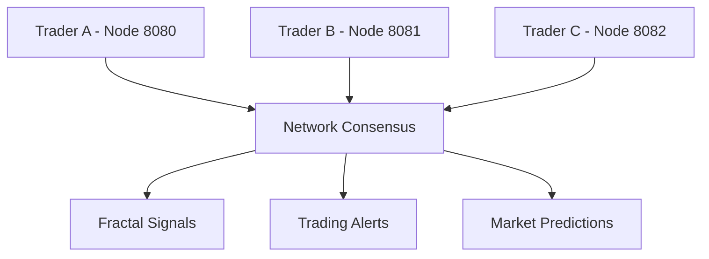

# IA P2P Trader - Sistema Proprietário de Trading
**Desenvolvido por Luiz - 2025**


## � Visão Geral

Sistema avançado de trading peer-to-peer com inteligência artificial que revoluciona o mercado financeiro através de:

- **Análise Fractal Proprietária**: Algoritmos únicos para detecção de padrões complexos
- **Rede P2P Descentralizada**: Consenso distribuído para sinais de alta precisão
- **IA Preditiva**: Machine learning para previsões de mercado em tempo real
- **Monetização Escalável**: Arquitetura pronta para gerar receita recorrenteal P2P Trader

Sistema avançado de trading que combina análise fractal, inteligência artificial e redes peer-to-peer para análise e predição de mercados financeiros.

## 🚀 Características Principais

- **🧮 Análise Fractal Avançada**: Detecta padrões auto-similares em dados de mercado usando algoritmos de box counting e expoente de Hurst
- **🤖 Inteligência Artificial**: ML com RandomForest para predições baseadas em características fractais
- **🌐 Rede P2P**: Sistema distribuído para consenso e validação de sinais de trading
- **� Interface Web**: Dashboard React moderno com gráficos em tempo real
- **⚡ API FastAPI**: Backend robusto com documentação automática e WebSockets
- **🖥️ Dashboard Desktop**: Interface Tkinter para análise local

## ⚡ Início Rápido

### 🎯 Opção 1: Execução Automática (Recomendado)

```bash
# Executar script de inicialização
python start.py

# Ou usar comandos diretos:
python start.py --demo        # Modo demonstração
python start.py --install    # Instalar dependências
python start.py --webapp     # Aplicação web completa
python start.py --dashboard  # Interface desktop
python start.py --p2p        # Rede P2P
```

### 📦 Opção 2: Instalação Manual

```bash
# 1. Instalar dependências Python
pip install -r requirements.txt

# 2. Instalar dependências Frontend (opcional)
cd frontend
npm install
cd ..
```

## 📋 Pré-requisitos

- **Python 3.9+** com pip
- **Node.js 16+** e npm (apenas para frontend web)
- **Windows PowerShell** (para execução de scripts)

---

## 📦 Estrutura do Projeto

```bash
fractal-p2p-simulator/
│
├── app/                    # Código da interface e simulador gráfico
│   ├── main.py             # Inicializador principal com UI
│   ├── fractal.py          # Lógica de geração fractal
│   └── visualizer.py       # Visualizações interativas
│
├── p2p/                    # Lógica da rede P2P (mínimo funcional)
│   ├── node.py             # Nó com lógica básica de comunicação
│   └── broadcast.py        # Propagação de fractais
│
├── data/                   # Armazena dados carregados/simulados
│   ├── market_data.csv     # Dados de mercado exemplo
│   └── fractals.json       # Padrões fractais salvos
│
├── frontend/               # Interface web React (opcional)
│   ├── src/               
│   └── package.json       
│
├── README.md               # Este arquivo
├── requirements.txt        # Dependências
├── .gitignore              # Arquivos a ignorar pelo Git
└── LICENSE                 # Licença (MIT por padrão)
```

---

## 🔧 Instalação Rápida

### 1. Clone e Configure
```bash
git clone <repo-url>
cd fractal-p2p-simulator
pip install -r requirements.txt
```

### 2. Execute o Simulador
```bash
python app/main.py
```

### 3. Inicie Rede P2P (opcional)
```bash
python p2p/node.py --port 8080
python p2p/node.py --port 8081  # Em outro terminal
```

---

## 🧮 Funcionalidades Principais

### 📈 Análise Fractal
- **Dimensão Fractal**: Calcula complexidade de séries temporais
- **Padrões Auto-Similares**: Identifica repetições em diferentes escalas
- **Predição Fractal**: Extrapola tendências baseada em geometria fractal
- **Hurst Exponent**: Mede persistência/anti-persistência das séries

### 🌐 Rede P2P
- **Nós Distribuídos**: Cada trader roda um nó independente
- **Consensus Fractal**: Nós votam em padrões detectados
- **Broadcast Inteligente**: Propaga apenas fractais significativos
- **Resiliência**: Rede funciona mesmo com nós offline

### 📊 Interface Trader
- **Gráficos Interativos**: Plotly/Matplotlib para visualização
- **Alertas Automáticos**: Notificações de padrões fractais
- **Simulação Monte Carlo**: Testa estratégias em cenários
- **Dashboard Real-time**: Monitoramento de múltiplos ativos

### 🔌 Integração de Dados
- **Yahoo Finance**: Dados gratuitos de ações
- **Alpha Vantage**: API profissional de mercado
- **CSV Import**: Carregamento de dados próprios
- **WebSocket**: Dados em tempo real

---

## 🎯 Como Usar

### Modo Básico - Análise Local
```python
from app.fractal import FractalAnalyzer
from app.trading_ai import TradingAI, FractalPredictor
from app.utils import generate_fractal_series, plot_series

# Carregar dados
analyzer = FractalAnalyzer()
data = analyzer.load_market_data("AAPL", period="1y")

# Análise fractal completa
fractals = analyzer.analyze_fractals(data)
signals = analyzer.generate_signals(fractals)

# Predição fractal avançada
predictor = FractalPredictor(window_size=30)
prices = data['Close'].values
predictor.fit(prices)
predictions = predictor.predict_next(prices, steps=10)

# Visualizar resultados
plot_series(prices, predictions, "AAPL - Análise Fractal")
```

### Modo Integrado - IA + Fractais + P2P
```python
from app.integrated_fractal_sim import IntegratedFractalTrader
import asyncio

# Inicializar trader integrado
trader = IntegratedFractalTrader()

# Análise completa combinando todas as tecnologias
async def analyze():
    results = await trader.analyze_and_trade("AAPL", period="1y")
    
    print("Análise Fractal:", results['fractal_analysis'])
    print("Sinal IA:", results['ai_analysis'])
    print("Predição P2P:", results['p2p_prediction'])
    print("Recomendação Final:", results['trading_recommendation'])

# Executar análise
asyncio.run(analyze())
```

### Modo Dashboard - Interface Gráfica
```bash
# Backend FastAPI
cd backend
python main.py

# Frontend React (novo terminal)
cd frontend
npm install
npm start

# Dashboard Python/Tkinter
cd app
python main.py
```

### Modo P2P - Rede Distribuída
```python
from p2p.node import FractalNode
from app.integrated_fractal_sim import FractalP2PNetwork

# Iniciar nó P2P
network = FractalP2PNetwork()
await network.start_network(port=8080)

# Conectar com outros nós (em terminais separados)
# Terminal 1: port=8080
# Terminal 2: port=8081  
# Terminal 3: port=8082

# Compartilhar análise fractal
from app.utils import generate_fractal_series
series = generate_fractal_series(length=500, hurst=0.7)
patterns = network.fractal_projector.extract_patterns(series)

for pattern in patterns:
    network.add_local_pattern(pattern)
    await network.broadcast_pattern(pattern)

# Obter consensus da rede
consensus = network.get_network_prediction("AAPL", n_steps=20)
print("Predição da Rede:", consensus)
```

---

## 🔬 Algoritmos Fractais

### 1. **Box Counting**
Calcula dimensão fractal dividindo o gráfico em caixas progressivamente menores.

### 2. **Detrended Fluctuation Analysis (DFA)**
Mede correlações de longo prazo em séries temporais.

### 3. **Multifractal Detrended Analysis**
Identifica múltiplas escalas fractais simultaneamente.

### 4. **Fractal Dimension Estimation**
Estima complexidade geométrica dos padrões de preço.

---

## 🌐 Arquitetura P2P



### Protocolo de Comunicação
1. **Discovery**: Nós se encontram automaticamente
2. **Authentication**: Validação de nós legítimos
3. **Data Sync**: Sincronização de dados de mercado
4. **Fractal Broadcast**: Compartilhamento de análises
5. **Consensus**: Votação em padrões identificados

---

## 📈 Casos de Uso

### Para Day Traders
- Identificação de pontos de entrada/saída
- Alertas de padrões fractais emergentes
- Backtesting de estratégias fractais

### Para Analistas Quantitativos
- Pesquisa de novos padrões fractais
- Validação de hipóteses em rede distribuída
- Análise de correlações multi-escala

### Para Desenvolvedores
- API para integração com outras ferramentas
- Extensibilidade via plugins
- Open source para contribuições

---

## 🚧 Roadmap

### Versão 1.0 (Atual)
- ✅ Análise fractal avançada com Box Counting e Hurst Exponent
- ✅ Preditor fractal com Random Forest e features engineered
- ✅ Interface gráfica Tkinter com visualizações interativas
- ✅ Dashboard web React com design moderno
- ✅ P2P funcional com consensus de padrões fractais
- ✅ Backend FastAPI com APIs RESTful
- ✅ Sistema integrado combinando IA + Fractais + P2P

### Versão 1.1 (Em Desenvolvimento)
- 🔄 WebSocket para dados em tempo real
- 🔄 Integração com APIs reais de mercado (Alpha Vantage, Yahoo Finance)
- 🔄 Alertas automáticos por email/Discord/Telegram
- 🔄 Backtesting automatizado de estratégias
- 🔄 Mobile app React Native

### Versão 2.0 (Roadmap)
- 📅 Deep Learning com LSTM/Transformer para séries temporais
- 📅 Blockchain para consensus descentralizado
- 📅 Plugin system para indicadores customizados
- 📅 Multi-timeframe analysis
- 📅 Portfolio optimization com Modern Portfolio Theory

---

## 🤝 Contribuição

Contribuições são bem-vindas! Por favor:

1. Fork o repositório
2. Crie uma branch para sua feature
3. Commit suas mudanças
4. Abra um Pull Request

---

## 📄 Licença

MIT License - veja o arquivo [LICENSE](LICENSE) para detalhes.

---

## 📞 Suporte

- 🐛 **Issues**: Reporte bugs no GitHub
- 💬 **Discussões**: Use GitHub Discussions
- 📧 **Email**: contato@fractal-p2p.com
- 🌐 **Docs**: [Wiki completa](https://github.com/user/fractal-p2p-simulator/wiki)

---

**🧠 Fractal P2P Simulator - Onde a matemática fractal encontra o trading distribuído!**
